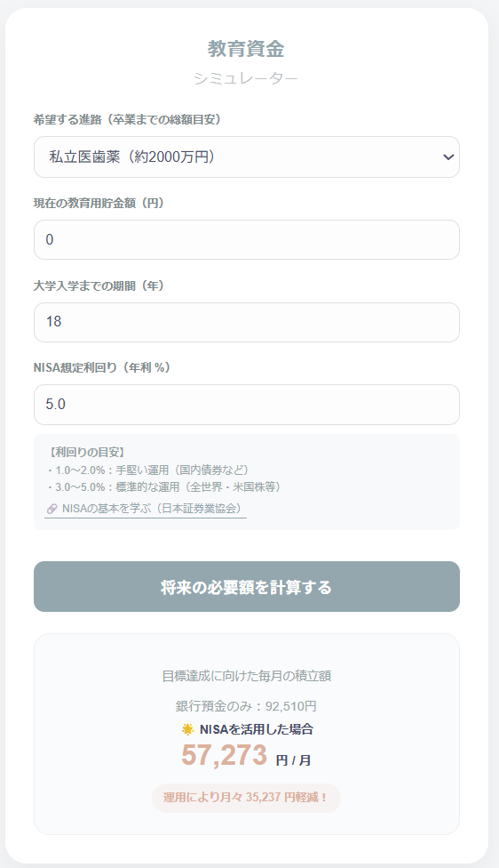

# 教育資金シミュレーター (NISA準備ガイド)

金融機関での実務経験と、メディア（NHK）での「情報を分かりやすく伝える」視点を掛け合わせて開発した、親世代向けの資金計画シミュレーション・アプリです。

## 📸 アプリイメージ

## 🌟 開発の背景と目的
新NISA制度の開始に伴い、「投資は必要だと感じるが、結局いくら積み立てればいいのか分からない」という不安を抱える親世代が増えています。
前職での金融知識を活かし、**「預金のみ」と「資産運用」の差を直感的に比較**することで、具体的な一歩を踏み出すための判断材料を提供することを目的に開発しました。

## ✨ 特徴とこだわった点
- **実務に即したシミュレーションロジック**: 
  - 銀行預金（0.01%想定）とNISA運用の差額を月単位で自動計算。目標額から逆算した「必要積立額」を提示。
- **UXデザイン（NHKでの経験を反映）**:
  - 専門用語を極力排除し、視覚的な負担を減らす「くすみカラー」を採用。
  - 入力欄の下に「全世界株」「債券」など、投資対象ごとの利回り目安を配置し、迷わせないUXを実現。
- **レスポンシブ対応**:
  - 外出先や隙間時間にスマートフォンで手軽に確認できるよう、CSS Flexboxを用いた画面設計。

## 🛠 テクニカルスタック
| カテゴリ | 技術内容 |
| :--- | :--- |
| **Language** | Java 17 |
| **Framework** | Spring Boot 3.x |
| **View** | Thymeleaf, HTML5, CSS3 |
| **Build Tool** | Maven |
| **Version Control** | GitHub |

## 💻 技術的工夫と課題解決
- **データ型のハンドリング**: 金融アプリとして「円単位」の正確な表示を重視。計算過程では浮動小数点を扱い、最終表示で適切な四捨五入・整数化を行うロジックを実装。
- **安全な画面表示**: ユーザーの未入力（Null）や想定外の操作によるエラーを防ぐため、Thymeleaf上での条件分岐処理を徹底し、ユーザー体験を損なわない設計に注力。
- **可読性の高いコード**: 業務での保守性を意識し、ロジック（Service）と表示（Controller）を分離したMVCモデルを採用。

## 🚀 今後の展望
- 入力エラー時のバリデーションメッセージ機能。
- ライフプランに合わせたグラフ描画機能の追加。

## 🚀 今後の展望（フェーズ2 開発予定）
ユーザーのライフステージに寄り添うツールとして、以下の機能を順次実装予定です。

- **ユーザー認証・ログイン機能（Spring Security）**: 
  - 個人アカウントを作成し、シミュレーション結果をセーブできる機能。
- **データベース連携（Spring Data JPA / MySQL等）**: 
  - データを永続化し、過去の試算履歴をいつでも確認可能に。
- **複数お子様管理・比較機能**: 
  - 第一子、第二子など、お子様ごとに異なる進路や貯蓄状況を個別に登録・比較できるダッシュボード機能。
- **バリデーション（入力チェック）の強化**: 
  - 負の数値や異常値の入力を防ぐ、堅牢なエラーハンドリングの実装。
